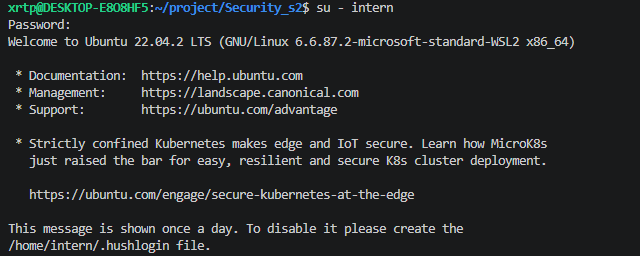

# Отчет по ДЗ 2 «Сейф»

## 1. Создание пользователя `intern`

Выполненные команды:

```bash
whoami
id
sudo useradd -m -s /bin/bash intern
sudo passwd intern
```

Результат:

```text
xrtp@DESKTOP-E8O8HF5:~/project/Security_s2$ whoami
xrtp
xrtp@DESKTOP-E8O8HF5:~/project/Security_s2$ id
uid=1000(xrtp) gid=1000(xrtp) groups=1000(xrtp),4(adm),20(dialout),24(cdrom),25(floppy),27(sudo),29(audio),30(dip),44(video),46(plugdev),116(netdev),1001(docker)
xrtp@DESKTOP-E8O8HF5:~/project/Security_s2$ sudo useradd -m -s /bin/bash intern
[sudo] password for xrtp:
xrtp@DESKTOP-E8O8HF5:~/project/Security_s2$ sudo passwd intern
New password:
Retype new password:
passwd: password updated successfully
```

## 2. Создание секретной папки и файла

Команды:

```bash
mkdir -p ~/top_secret
printf 'Super Secret Launch Codes\n' > ~/top_secret/codes.txt
```

## 3. Права на папку `top_secret`

Команды:

```bash
chmod 700 ~/top_secret
ls -ld ~/top_secret
```

Результат:

```text
xrtp@DESKTOP-E8O8HF5:~/project/Security_s2$ ls -ld ~/top_secret
drwx------ 2 xrtp xrtp 4096 Apr 23 12:15 /home/xrtp/top_secret
```

## 4. Права на файл `codes.txt`

Команды:

```bash
chmod 600 ~/top_secret/codes.txt
ls -l ~/top_secret/codes.txt
```

Результат:

```text
xrtp@DESKTOP-E8O8HF5:~/project/Security_s2$ ls -l ~/top_secret/codes.txt
-rw------- 1 xrtp xrtp 26 Apr 23 12:15 /home/xrtp/top_secret/codes.txt
```

## 5. Проверка защиты от имени `intern`



Команды:

```bash
su - intern
cat /home/xrtp/top_secret/codes.txt
exit
```

Скриншот или копипаст попытки чтения:

```text
xrtp@DESKTOP-E8O8HF5:~/project/Security_s2$ su - intern
Password:
Welcome to Ubuntu 22.04.2 LTS (GNU/Linux 6.6.87.2-microsoft-standard-WSL2 x86_64)

 * Documentation:  https://help.ubuntu.com
 * Management:     https://landscape.canonical.com
 * Support:        https://ubuntu.com/advantage

 * Strictly confined Kubernetes makes edge and IoT secure. Learn how MicroK8s
   just raised the bar for easy, resilient and secure K8s cluster deployment.

   https://ubuntu.com/engage/secure-kubernetes-at-the-edge

This message is shown once a day. To disable it please create the
/home/intern/.hushlogin file.
intern@DESKTOP-E8O8HF5:~$ cat /home/xrtp/top_secret/codes.txt
cat: /home/xrtp/top_secret/codes.txt: Permission denied
intern@DESKTOP-E8O8HF5:~$ exit
logout
```

## 6. Генерация SSH-ключей

Команды:

```bash
mkdir -p ~/.ssh
chmod 700 ~/.ssh
ssh-keygen -t ed25519 -f ~/.ssh/id_ed25519
cat ~/.ssh/id_ed25519.pub >> ~/.ssh/authorized_keys
chmod 600 ~/.ssh/authorized_keys
chmod 600 ~/.ssh/id_ed25519
ls -la ~/.ssh
```

Важно:

- в отчет не включено содержимое приватного ключа `id_ed25519`;
- публичный ключ был добавлен в `authorized_keys`.

## 7. Права на `.ssh` и ключи

Результат:

```text
xrtp@DESKTOP-E8O8HF5:~/project/Security_s2$ mkdir -p ~/.ssh
xrtp@DESKTOP-E8O8HF5:~/project/Security_s2$ chmod 700 ~/.ssh
xrtp@DESKTOP-E8O8HF5:~/project/Security_s2$ ssh-keygen -t ed25519 -f ~/.ssh/id_ed25519
Generating public/private ed25519 key pair.
Enter passphrase (empty for no passphrase):
Enter same passphrase again:
Your identification has been saved in /home/xrtp/.ssh/id_ed25519
Your public key has been saved in /home/xrtp/.ssh/id_ed25519.pub
The key fingerprint is:
SHA256:opM0UxygRf9BQu6Ucrrb6fjLp6a/r71Hj6b0wERZl4E xrtp@DESKTOP-E8O8HF5
The key's randomart image is:
+--[ED25519 256]--+
|   .+o+ . ..oo   |
|   o + = oE..    |
|  . . O +        |
|     B o .       |
|    = o S        |
|   . * +  .      |
|    =   +. o     |
|     *.+.o+ .    |
|    +*%B==.      |
+----[SHA256]-----+
xrtp@DESKTOP-E8O8HF5:~/project/Security_s2$ cat ~/.ssh/id_ed25519.pub >> ~/.ssh/authorized_keys
xrtp@DESKTOP-E8O8HF5:~/project/Security_s2$ chmod 600 ~/.ssh/authorized_keys
xrtp@DESKTOP-E8O8HF5:~/project/Security_s2$ chmod 600 ~/.ssh/id_ed25519
xrtp@DESKTOP-E8O8HF5:~/project/Security_s2$ ls -la ~/.ssh
total 20
drwx------  2 xrtp xrtp 4096 Apr 23 12:16 .
drwxr-x--- 11 xrtp xrtp 4096 Apr 23 12:15 ..
-rw-------  1 xrtp xrtp  102 Apr 23 12:16 authorized_keys
-rw-------  1 xrtp xrtp  411 Apr 23 12:16 id_ed25519
-rw-r--r--  1 xrtp xrtp  102 Apr 23 12:16 id_ed25519.pub
```

## 8. Итог

По результатам выполнения задания:

- пользователь `intern` успешно создан;
- папка `top_secret` и файл `codes.txt` созданы;
- права выставлены корректно: `700` на папку и `600` на файл;
- пользователь `intern` получает `Permission denied` при попытке чтения;
- SSH-ключи созданы;
- права на `.ssh`, `authorized_keys` и приватный ключ выставлены правильно.
