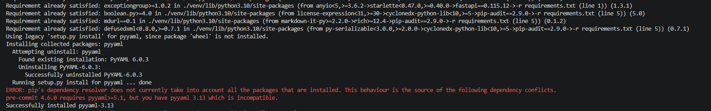
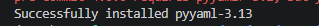
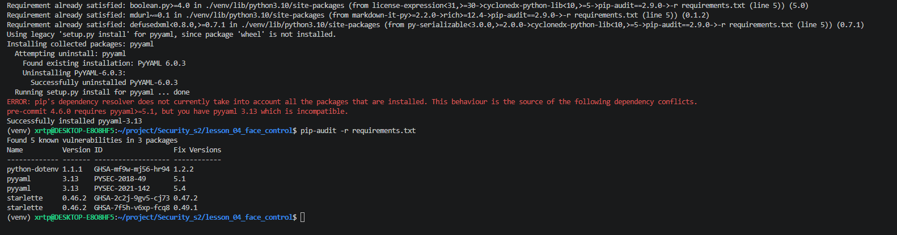
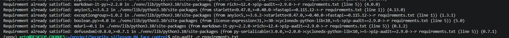
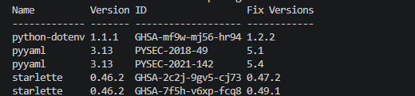

# Отчет по ДЗ 5 «Санитарный день»

## Ссылка на GitHub

```text
[https://github.com/Larl12/Security_s2]
```

## Что было проверено

Проект для аудита:





Итоговый `requirements.txt`:

```text
fastapi==0.115.12
uvicorn==0.34.2
pydantic[email]==2.11.4
python-dotenv==1.1.1
pip-audit==2.9.0
```

## Скриншот 1. Найденная уязвимость




После этого выполните:

```bash
cd ~/project/Security_s2/lesson_04_face_control
python3 -m venv venv
source venv/bin/activate
pip install -r requirements.txt
pip install pip-audit
pip-audit -r requirements.txt
```

уязвимость:



## Исправление

После скриншота удали уязвимый пакет `pyyaml==3.13` из `requirements.txt` и верни файл к безопасному виду:

```text
fastapi==0.115.12
uvicorn==0.34.2
pydantic[email]==2.11.4
python-dotenv==1.1.1
pip-audit==2.9.0
```

Установиливаем зависимости заново и выполните аудит повторно:

```bash
pip install -r requirements.txt
pip-audit -r requirements.txt
```

## Скриншот 2. Чистый аудит





## Pre-commit

Файл `.pre-commit-config.yaml`:

```yaml
repos:
  - repo: local
    hooks:
      - id: pip-audit
        name: pip-audit
        entry: pip-audit -r lesson_04_face_control/requirements.txt
        language: system
        files: ^lesson_04_face_control/requirements\.txt$
```

## Деплой на сервер

Команды:

```bash
git pull
cd ~/project/Security_s2/lesson_04_face_control
source venv/bin/activate
pip install -r requirements.txt
uvicorn src.main:app --host 0.0.0.0 --port 8000
```

## Коммит

```text
Task 5 ready.
```
