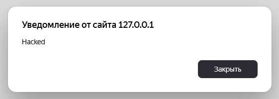
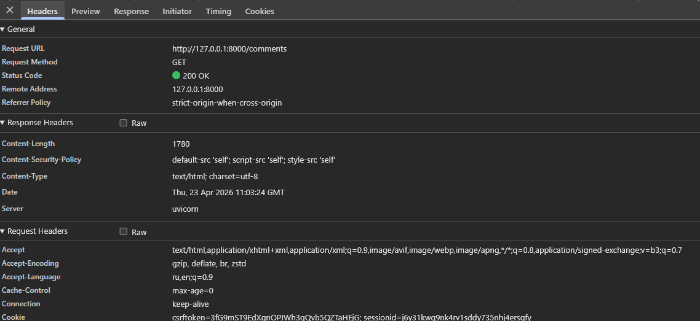
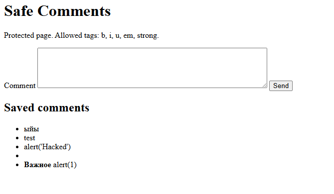
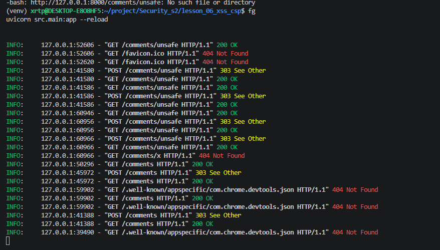

# Отчет по ДЗ 6 «Стена плача (и комментариев)»

## Ссылка на GitHub

https://github.com/Larl12/Security_s2

## Структура проекта

```text
lesson_06_xss_csp/
├── requirements.txt
├── security_report_06.md
├── src
│   ├── __init__.py
│   └── main.py
└── templates
    └── comments.html
```

## Что реализовано

- `GET /comments` — защищенная страница комментариев
- `POST /comments` — сохранение комментария в памяти
- `GET /comments/unsafe` — уязвимая страница для демонстрации XSS
- `POST /comments/unsafe` — отправка комментария в уязвимый режим
- санитизация текста через `bleach`
- строгий заголовок `Content-Security-Policy`

## Функция-санитайзер

```python
def sanitize_comment(text: str) -> str:
    return bleach.clean(text, tags=["b", "i", "u", "em", "strong"], attributes={}, strip=True)
```

## Команды запуска

```bash
cd ~/project/Security_s2/lesson_06_xss_csp
python3 -m venv venv
source venv/bin/activate
pip install -r requirements.txt
uvicorn src.main:app --reload
```

### 1. Скриншот успешной XSS-атаки до защиты

Открой:

```text
http://127.0.0.1:8000/comments/unsafe
```

Отправь:

```html

```

Вставь сюда скриншот с `alert()`:




### 2. Скриншот заголовков ответа с CSP

Открой:

```text
http://127.0.0.1:8000/comments
```


Во вкладке `Network` :

```text
Content-Security-Policy: default-src 'self'; script-src 'self'; style-src 'self'
```

Вставь сюда скриншот:



### 3. Скриншот заблокированной атаки

На защищенной странице отправь:

```html
<b>Важное</b> <script>alert(1)</script>
```

Ожидание:

- на странице остается только безопасный текст
- скрипт не исполняется
- в `Console` видно блокировку CSP при попытке инлайн-скрипта

Вставь сюда скриншот консоли:




## Деплой на сервер

```bash
git pull
cd ~/project/Security_s2/lesson_06_xss_csp
python3 -m venv venv
source venv/bin/activate
pip install -r requirements.txt
uvicorn src.main:app --host 0.0.0.0 --port 8000
```


