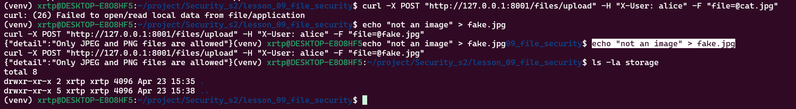
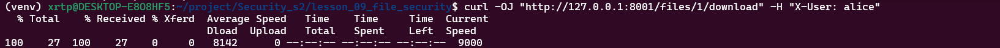

# Отчет по ДЗ 9 «Надежное хранилище»

## Ссылка на GitHub

https://github.com/Larl12/Security_s2

## Что реализовано

- безопасная загрузка через `POST /files/upload`
- ограничение размера до `2 МБ`
- проверка типа файла по содержимому через `filetype`
- сохранение файла на диск только под UUID-именем
- хранение метаданных в `files_db`
- скачивание через `GET /files/{file_id}/download`
- защита скачивания через проверку прав доступа
- `Content-Disposition: attachment` с оригинальным именем файла

## Структура проекта

```text
lesson_09_file_security/
├── requirements.txt
├── report_lesson9.md
└── src
    ├── __init__.py
    └── main.py
```

## Команды запуска

```bash
cd ~/project/Security_s2/lesson_09_file_security
python3 -m venv venv
source venv/bin/activate
pip install -r requirements.txt
uvicorn src.main:app --reload
```

## Что показать в отчете

### 1. Скриншот папки storage


Пример команды:

```bash
ls -la storage
```

### 2. Скриншот ошибки при загрузке fake.jpg


Ожидаемая ошибка:



### 3. Скриншот успешного скачивания


## Пример curl для загрузки

```bash
curl -X POST "http://127.0.0.1:8000/files/upload" \
  -H "X-User: alice" \
  -F "file=@cat.jpg"
```


## Пример curl для скачивания

```bash
curl -OJ "http://127.0.0.1:8000/files/1/download" -H "X-User: alice"
```



## Деплой на сервер

```bash
git pull
cd ~/project/Security_s2/lesson_09_file_security
python3 -m venv venv
source venv/bin/activate
pip install -r requirements.txt
uvicorn src.main:app --host 0.0.0.0 --port 8000
```

